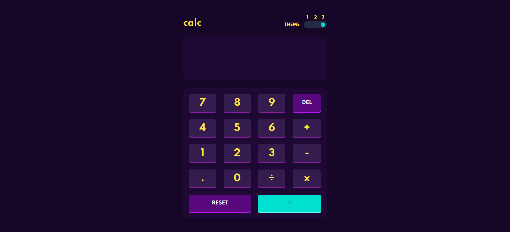

# Frontend Mentor - Calculator app solution

This is a solution to the [Calculator app challenge on Frontend Mentor](https://www.frontendmentor.io/challenges/calculator-app-9lteq5N29).

## Table of contents

- [Overview](#overview)
  - [The challenge](#the-challenge)
  - [Screenshot](#screenshot)
  - [Get Started](#get-started)
  - [Links](#links)
- [My process](#my-process)
  - [Built with](#built-with)
  - [What I learned](#what-i-learned)
  - [Useful resources](#useful-resources)
- [Author](#author)
- [License](#license)

## Overview

### The challenge

Users should be able to:

- See the size of the elements adjust based on their device's screen size.
- Perform mathmatical operations like addition, subtraction, multiplication, and division.
- Adjust the color theme based on their preference.
- **Bonus**: Have their initial theme preference checked using `prefers-color-scheme` and have any additional changes saved in the browser.

### Screenshot

;

### Get Started

In order to get started, you need to make sure you have [SASS](https://sass-lang.com/) on your machine, if you dont you can run on your bash:

```bash
$ npm install sass -g
```

Or, if you prefer to use yarn:

```bash
$ yarn add sass
```

Then, proceed to clone the repository using:

```bash
$ git clone https://github.com/whoiscaio/calculator-app.git
```

And you are ready.

### Links

- Solution URL: [Github](https://github.com/whoiscaio/calculator-app)
- Live Site URL: [Github Pages](https://whoiscaio.github.io/calculator-app/)

## My process

### Built with

- Semantic HTML5 markup
- CSS
- Flexbox
- CSS Grid
- [SASS](https://sass-lang.com/) - SASS website

### What I learned

This project was extremely important to me due to so many things. It was my very first time i made a real project using OOP (Object-Oriented Programming), it was also very important to strengthen my knowledge on SASS and things like mixins, and last but not least, it made me able to define the theme based on the system preference, which was amazing.

```scss
@media (prefers-color-scheme: no-preference) {
  body {
    @include theme-one;
  }
}

@media (prefers-color-scheme: light) {
  body {
    @include theme-two;
  }
}

@media (prefers-color-scheme: dark) {
  
  body {
    @include theme-three;
  }
}
```

I also learned a little bit about regex, and i used it to create a filter to the input content of the calculator, so i will make sure that everything passed there is a mathematic operation and nothing else.

```js
this.regex = /[a-z]/i;
this.danger = false;

let filter = this.display.value;
filter = filter.replace('x', '*');
filter = filter.replace('÷', '/');
let test = filter.split('');

test.forEach(char => {
  if (this.regex.test(char)) {
    this.danger = true;
  }
});
```

### Useful resources

- [Article in Portuguese about Regular Expressions](https://medium.com/xp-inc/regex-um-guia-pratico-para-express%C3%B5es-regulares-1ac5fa4dd39f) - This is an amazing article which helped me finally understand Regular Expressions. I'd recommend it to anyone still learning this concept.

- [Article in English about prefers-color-scheme](https://web.dev/prefers-color-scheme/) - Another amazing article that helped me to undertand prefers-color-scheme, a concept that was required to this project but i didn't knew it existed until now.

## Author

- Frontend Mentor - [@whoiscaio](https://www.frontendmentor.io/profile/whoiscaio)
- Github - [whoiscaio](https://github.com/whoiscaio)
- Linkedin - [Caio Lima](https://www.linkedin.com/in/lima-caio/)

## License

This project is licensed under the MIT License - see the [LICENSE](LICENSE) file for details.
